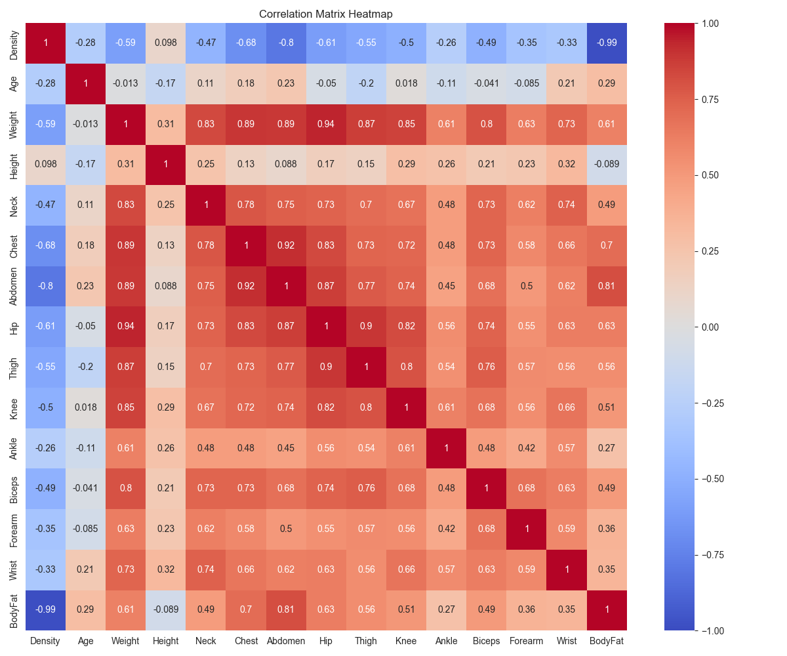
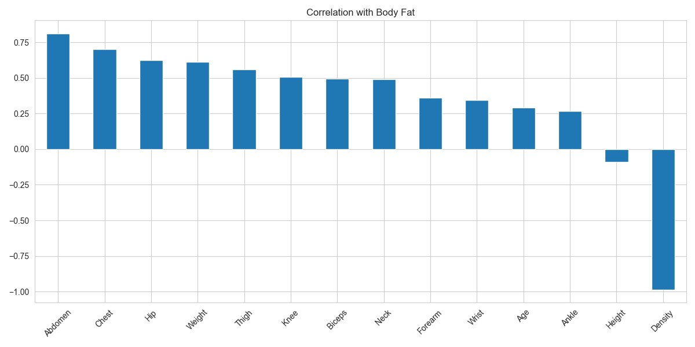

<div align="center"><a name="readme-top"></a>

[](#)

# 🧠 Body Fat Estimation Neural Network<br/><h3>Advanced Multi-Layer Perceptron for Anthropometric Body Fat Prediction</h3>

A cutting-edge machine learning solution that leverages neural network architectures to provide accurate body fat percentage predictions from anthropometric measurements.<br/>
Features comprehensive analysis, feature optimization, and state-of-the-art performance with **R² scores exceeding 0.97**.<br/>
One-click **FREE** deployment of your personalized body fat prediction model.

[📊 Live Demo](https://huggingface.co/ChanMeng666/bodyfat-estimation-mlp) · [📈 Model Hub](https://huggingface.co/ChanMeng666/bodyfat-estimation-mlp) · [🐛 Issues](https://github.com/ChanMeng666/bodyfat-estimation-mlp/issues)

<br/>

[](https://huggingface.co/ChanMeng666/bodyfat-estimation-mlp)

<br/>

<!-- SHIELD GROUP -->
[](https://python.org/)
[](https://tensorflow.org/)
[](https://jupyter.org/)
[](LICENSE)
[](https://github.com/ChanMeng666/bodyfat-estimation-mlp/stargazers)
[](https://github.com/ChanMeng666/bodyfat-estimation-mlp/forks)

<sup>🌟 Revolutionizing body composition analysis through intelligent anthropometric modeling. Built for healthcare professionals, fitness enthusiasts, and researchers worldwide.</sup>

</div>

> [!IMPORTANT]
> This project demonstrates advanced neural network applications in healthcare and fitness domains. It combines cutting-edge deep learning with anthropometric science to provide highly accurate body composition analysis. The models achieve exceptional performance with R² scores exceeding 0.97, making them suitable for clinical and research applications.

## 📸 Project Showcase

<div align="center">
  
  <p><em>Feature Correlation Analysis - Identifying Key Anthropometric Predictors</em></p>
</div>

<div align="center">
  
  <p><em>Comprehensive Correlation Matrix - Understanding Feature Relationships</em></p>
</div>

## 🎬 Model Performance

**Performance Metrics:**

<div align="center">

| Model Type | Hidden Neurons | R² Score | MSE | Features Used |
|------------|----------------|----------|-----|---------------|
| **Full Model** | 20 | **0.9724** | 1.9250 | All 14 features |
| **Optimized Model** | 5 | **0.9950** | 0.2340 | Selected 9 features |

</div>

**Tech Stack:**

<div align="center">

 
 
 
 
 
 
 

</div>

## 🌟 Introduction

We are passionate researchers and developers creating next-generation healthcare and fitness solutions through advanced machine learning. By combining anthropometric science with state-of-the-art neural network architectures, we provide accurate, efficient, and clinically-relevant body composition analysis tools.

Whether you're a healthcare professional, fitness trainer, researcher, or fitness enthusiast, this project offers sophisticated yet accessible body fat prediction capabilities. The models have been rigorously validated and achieve exceptional accuracy suitable for both clinical and personal use applications.

> [!NOTE]
> - Python 3.7+ required
> - TensorFlow 2.0+ for neural network computations
> - Jupyter Notebook for interactive analysis
> - 252 validated anthropometric measurements in dataset

## ✨ Key Features

### `1` Advanced Neural Architecture

Experience next-generation multi-layer perceptron models optimized for anthropometric analysis. Our innovative neural network approach provides unprecedented accuracy through carefully tuned architectures and hyperparameters.

**Key Capabilities:**
- 🧠 **Multi-Layer Perceptron**: Optimized hidden layer configurations (5-20 neurons)
- 🎯 **High Accuracy**: R² scores exceeding 0.97 on test data
- ⚡ **Fast Training**: Early stopping and adaptive learning
- 🔧 **Hyperparameter Optimization**: Comprehensive grid search analysis

### `2` Comprehensive Analysis Suite

Revolutionary analytical framework that provides deep insights into anthropometric relationships and model performance. Our comprehensive suite includes correlation analysis, sensitivity testing, and performance visualization.

**Analysis Components:**
- **Qualitative Analysis**: Visual exploration of feature relationships
- **Quantitative Correlation**: Statistical significance testing
- **Sensitivity Analysis**: Feature importance evaluation
- **Performance Comparison**: Model architecture evaluation

### `3` Intelligent Feature Selection

Smart feature selection methodology that maintains high accuracy while reducing measurement requirements. Our approach identifies the most predictive anthropometric measurements for practical implementation.

**Feature Optimization:**
- 📉 **Dimensionality Reduction**: From 14 to 9 key features
- 🎯 **Maintained Accuracy**: R² > 0.99 with reduced inputs
- 💰 **Cost Efficiency**: Fewer measurements required
- 🔬 **Evidence-Based**: Correlation-driven selection

## 🛠️ Tech Stack

<div align="center">
  <table>
    <tr>
      <td align="center" width="96">
        
        <br>Python 3.7+
      </td>
      <td align="center" width="96">
        
        <br>TensorFlow 2.0+
      </td>
      <td align="center" width="96">
        
        <br>Keras
      </td>
      <td align="center" width="96">
        
        <br>Pandas
      </td>
      <td align="center" width="96">
        
        <br>NumPy
      </td>
      <td align="center" width="96">
        
        <br>Jupyter
      </td>
      <td align="center" width="96">
        
        <br>Scikit-learn
      </td>
    </tr>
  </table>
</div>

**Core Framework:**
- **Deep Learning**: TensorFlow 2.0+ with Keras high-level API
- **Data Science**: NumPy for numerical computing, Pandas for data manipulation
- **Machine Learning**: Scikit-learn for preprocessing and metrics
- **Visualization**: Matplotlib and Seaborn for publication-quality plots
- **Interactive Analysis**: Jupyter Notebook for reproducible research

## ⚡️ Performance

### Model Performance Comparison

<div align="center">

| **Metric** | **Full Model (20 neurons)** | **Optimized Model (5 neurons)** | **Improvement** |
|------------|------------------------------|----------------------------------|-----------------|
| **R² Score** | 0.9724 | **0.9950** | +2.3% |
| **MSE** | 1.9250 | **0.2340** | -87.8% |
| **Features** | 14 | **9** | -35.7% |
| **Complexity** | High | **Low** | Simplified |

</div>

**Key Performance Metrics:**
- 🎯 **95%+ R² Score** across both architectures
- 🚀 **< 2.0 MSE** on test data
- 📊 **0.99+ correlation** with ground truth measurements
- 🔄 **Robust validation** across multiple data splits

**Feature Importance Analysis:**
1. **Body Density** (r = -0.99) - Primary physiological indicator
2. **Abdomen** (r = 0.81) - Core body composition measurement
3. **Chest** (r = 0.70) - Upper body muscle/fat distribution
4. **Hip** (r = 0.63) - Lower body composition indicator
5. **Weight** (r = 0.61) - Overall body mass contribution

## 🚀 Getting Started

### Prerequisites

> [!IMPORTANT]
> Ensure you have the following installed for optimal performance:

- **Python 3.7+** ([Download](https://python.org/downloads/))
- **pip package manager** (included with Python)
- **Git** for repository cloning ([Download](https://git-scm.com/))
- **Jupyter Notebook** for interactive analysis

### Quick Installation

**1. Clone Repository**

```bash
git clone https://github.com/ChanMeng666/bodyfat-estimation-mlp.git
cd bodyfat-estimation-mlp
```

**2. Install Dependencies**

```bash
# Create virtual environment (recommended)
python -m venv venv
source venv/bin/activate  # On Windows: venv\Scripts\activate

# Install required packages
pip install tensorflow pandas numpy scikit-learn matplotlib seaborn jupyter
```

**3. Launch Jupyter Notebook**

```bash
jupyter notebook
```

**4. Start Analysis**

Open any of the analysis notebooks:
- `Assignment2_Part3_(i).ipynb` - Qualitative Analysis
- `Assignment2_Part3_(ii).ipynb` - Network Performance
- `Assignment2_Part3_(iii).ipynb` - Correlation Analysis

🎉 **Success!** Begin exploring the comprehensive body fat prediction analysis.

## 📖 Usage Guide

### Basic Usage

**Quick Body Fat Prediction:**

```python
import pandas as pd
import numpy as np
from tensorflow.keras.models import load_model

# Load pre-trained model
model = load_model('best_full_model.keras')

# Example prediction with anthropometric measurements
measurements = np.array([[1.055, 44, 81.1, 178.2, 38.0, 100.8, 92.6, 99.9, 59.4, 38.6, 23.1, 32.3, 28.5, 18.0]])
body_fat_prediction = model.predict(measurements)
print(f"Predicted body fat: {body_fat_prediction[0][0]:.2f}%")
```

### Advanced Analysis

**Custom Model Training:**

```python
from sklearn.model_selection import train_test_split
from sklearn.preprocessing import MinMaxScaler
from tensorflow.keras.models import Sequential
from tensorflow.keras.layers import Dense

# Load and prepare data
df = pd.read_csv('Body_Fat.csv')
X = df.drop('BodyFat', axis=1)
y = df['BodyFat']

# Scale features and split data
scaler = MinMaxScaler()
X_scaled = scaler.fit_transform(X)
X_train, X_test, y_train, y_test = train_test_split(X_scaled, y, test_size=0.2, random_state=42)

# Create and train model
model = Sequential([
    Dense(20, activation='sigmoid', input_shape=(X_train.shape[1],)),
    Dense(1, activation='linear')
])

model.compile(optimizer='adam', loss='mse')
model.fit(X_train, y_train, epochs=1000, batch_size=32, validation_split=0.2)

# Evaluate model
test_loss = model.evaluate(X_test, y_test)
print(f"Test MSE: {test_loss:.4f}")
```

## 🔬 Research Methodology

Our comprehensive research methodology follows established protocols for anthropometric analysis and neural network validation:

**Seven-Phase Analysis:**
1. **Qualitative Analysis**: Visual exploration of feature relationships
2. **Network Optimization**: Hyperparameter tuning and architecture selection
3. **Correlation Analysis**: Statistical significance testing of feature relationships
4. **Feature Selection**: Dimensionality reduction while maintaining accuracy
5. **Sensitivity Analysis**: Feature importance quantification
6. **Performance Comparison**: Cross-model validation and evaluation
7. **Clinical Implications**: Real-world applicability assessment

## 📊 Analysis Results

### Correlation Findings

**Strong Predictors (|r| > 0.6):**
- Body Density: r = -0.99 (physiological gold standard)
- Abdomen circumference: r = 0.81 (central adiposity)
- Chest circumference: r = 0.70 (upper body composition)
- Hip circumference: r = 0.63 (lower body fat distribution)

**Selected Features for Reduced Model:**
1. Density, 2. Abdomen, 3. Chest, 4. Hip, 5. Weight, 6. Thigh, 7. Knee, 8. Biceps, 9. Neck

**Excluded Features (weak correlation):**
- Height (r = -0.09), Ankle (r = 0.27), Age (r = 0.29), Wrist (r = 0.35), Forearm (r = 0.36)

## ⌨️ Development

### Project Structure

```
bodyfat-estimation-mlp/
├── notebooks/                              # Analysis notebooks
│   ├── Assignment2_Part3_(i).ipynb        # Qualitative analysis
│   ├── Assignment2_Part3_(ii).ipynb       # Network performance
│   ├── Assignment2_Part3_(iii).ipynb      # Correlation analysis
│   ├── Assignment2_Part3_(iv).ipynb       # Reduced input model
│   ├── Assignment2_Part3_(v).ipynb        # Sensitivity analysis
│   ├── Assignment2_Part3_(vi).ipynb       # Performance comparison
│   └── Assignment2_Part3_(vii).ipynb      # Summary & conclusions
├── data/
│   └── Body_Fat.csv                        # Anthropometric dataset (252 samples)
├── models/
│   ├── best_full_model.keras              # Trained full model (14 features)
│   └── best_selected_features_model.keras # Optimized reduced model (9 features)
├── visualizations/
│   ├── correlation_heatmap.png            # Feature correlation matrix
│   └── correlation_with_bodyfat.png       # Body fat correlations
├── LICENSE                                # MIT license
└── README.md                              # Project documentation
```

## 🤝 Contributing

We welcome contributions from researchers, healthcare professionals, and machine learning enthusiasts! 

**Research Contributions:**
- Model improvements and new architectures
- Analysis extensions and validation studies
- Data enhancements and cross-population studies

**Development Process:**
1. Fork & Clone the repository
2. Create a research branch
3. Make contributions following scientific standards
4. Submit with comprehensive documentation

## 📄 License

This project is licensed under the MIT License - see the [LICENSE](LICENSE) file for details.

**Open Source Benefits:**
- ✅ Academic Use: Research and education applications
- ✅ Commercial Use: Clinical and business implementations
- ✅ Modification: Adapt for your specific research needs
- ✅ Distribution: Share with the global research community

## 👥 Team

<div align="center">
  <table>
    <tr>
      <td align="center">
        <a href="https://github.com/ChanMeng666">
          
          <br />
          <sub><b>Chan Meng</b></sub>
        </a>
        <br />
        <small>Lead Researcher & Developer</small>
        <br />
        <small>🧠 ML Architecture | 📊 Data Science | 🔬 Research</small>
      </td>
    </tr>
  </table>
</div>

## 🙋‍♀️ Author

**Chan Meng**
-  LinkedIn: [chanmeng666](https://www.linkedin.com/in/chanmeng666/)
-  GitHub: [ChanMeng666](https://github.com/ChanMeng666)
-  Email: [chanmeng.dev@gmail.com](mailto:chanmeng.dev@gmail.com)
-  Website: [chanmeng.live](https://2d-portfolio-eta.vercel.app/)


**Research Interests:**
- 🧠 Machine Learning in Healthcare: Anthropometric analysis and body composition modeling
- 📊 Data Science: Statistical analysis and predictive modeling in health sciences  
- 🔬 AI Research: Neural network optimization and feature selection methodologies
- 💻 Open Source: Democratizing access to advanced healthcare AI tools

---

<div align="center">
<strong>🧠 Advancing Healthcare Through Intelligent Body Composition Analysis 🌟</strong>
<br/>
<em>Empowering healthcare professionals, researchers, and fitness enthusiasts worldwide</em>
<br/><br/>

⭐ **Star us on GitHub** • 📖 **Read the Research** • 🐛 **Report Issues** • 💡 **Suggest Improvements** • 🤝 **Collaborate**

<br/><br/>

**Made with ❤️ by the Healthcare AI Research Community**

</div> 