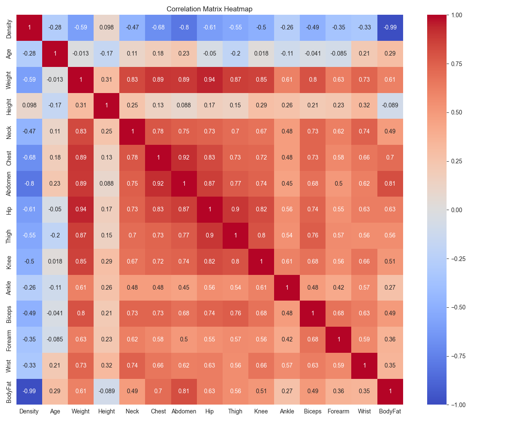
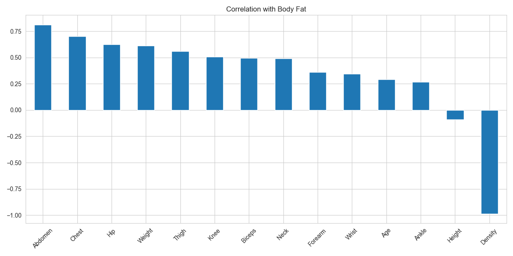

<div align="center"><a name="readme-top"></a>

[](#)

# Body Fat Estimation Neural Network<br/><h3>Multi-Layer Perceptron for Anthropometric Body Fat Prediction</h3>

A machine learning project that uses neural network architectures to predict body fat percentage from anthropometric measurements.<br/>
Features a comprehensive seven-phase analysis pipeline, intelligent feature selection, and pre-trained models achieving **R² scores exceeding 0.97**.

[Live Demo](https://huggingface.co/ChanMeng666/bodyfat-estimation-mlp) · [Issues](https://github.com/ChanMeng666/bodyfat-estimation-mlp/issues)

<br/>

<!-- SHIELD GROUP -->
[](https://python.org/)
[](https://tensorflow.org/)
[](https://jupyter.org/)
[](LICENSE)
[](https://github.com/ChanMeng666/bodyfat-estimation-mlp/stargazers)
[](https://github.com/ChanMeng666/bodyfat-estimation-mlp/forks)

</div>

## Project Showcase

<div align="center">
  
  <p><em>Feature Correlation Analysis — Identifying Key Anthropometric Predictors</em></p>
</div>

<div align="center">
  
  <p><em>Correlation Matrix — Understanding Feature Relationships</em></p>
</div>

## Model Performance

<div align="center">

| Model Type | Hidden Neurons | R² Score | MSE | Features Used |
|------------|----------------|----------|-----|---------------|
| **Full Model** | 20 | **0.9724** | 1.9250 | All 14 features |
| **Optimized Model** | 5 | **0.9950** | 0.2340 | Selected 9 features |

</div>

### Performance Comparison

<div align="center">

| Metric | Full Model (20 neurons) | Optimized Model (5 neurons) | Improvement |
|--------|-------------------------|------------------------------|-------------|
| R² Score | 0.9724 | **0.9950** | +2.3% |
| MSE | 1.9250 | **0.2340** | -87.8% |
| Features | 14 | **9** | -35.7% |
| Complexity | High | **Low** | Simplified |

</div>

### Feature Importance

1. **Body Density** (r = -0.99) — Primary physiological indicator
2. **Abdomen** (r = 0.81) — Core body composition measurement
3. **Chest** (r = 0.70) — Upper body muscle/fat distribution
4. **Hip** (r = 0.63) — Lower body composition indicator
5. **Weight** (r = 0.61) — Overall body mass contribution

## Tech Stack

<div align="center">
  <table>
    <tr>
      <td align="center" width="96">
        
        <br>Python 3.7+
      </td>
      <td align="center" width="96">
        
        <br>TensorFlow 2.0+
      </td>
      <td align="center" width="96">
        
        <br>Keras
      </td>
      <td align="center" width="96">
        
        <br>Pandas
      </td>
      <td align="center" width="96">
        
        <br>NumPy
      </td>
      <td align="center" width="96">
        
        <br>Jupyter
      </td>
      <td align="center" width="96">
        
        <br>Scikit-learn
      </td>
    </tr>
  </table>
</div>

- **Deep Learning**: TensorFlow 2.0+ with Keras high-level API
- **Data Science**: NumPy for numerical computing, Pandas for data manipulation
- **Machine Learning**: Scikit-learn for preprocessing and evaluation metrics
- **Visualization**: Matplotlib and Seaborn for publication-quality plots
- **Interactive Analysis**: Jupyter Notebook for reproducible research

## Getting Started

### Prerequisites

- **Python 3.7+** ([Download](https://python.org/downloads/))
- **pip** package manager (included with Python)
- **Git** ([Download](https://git-scm.com/))

### Installation

**1. Clone the repository**

```bash
git clone https://github.com/ChanMeng666/bodyfat-estimation-mlp.git
cd bodyfat-estimation-mlp
```

**2. Create virtual environment (recommended)**

```bash
python -m venv venv
source venv/bin/activate  # On Windows: venv\Scripts\activate
```

**3. Install dependencies**

```bash
pip install -r requirements.txt
```

**4. Launch Jupyter Notebook**

```bash
jupyter notebook
```

**5. Run the analysis**

Open notebooks sequentially from the `notebooks/` directory:

| Notebook | Description |
|----------|-------------|
| `01_qualitative_analysis.ipynb` | Visual exploration of feature relationships |
| `02_network_performance.ipynb` | Hyperparameter tuning and architecture optimization |
| `03_correlation_analysis.ipynb` | Statistical significance testing |
| `04_reduced_input_model.ipynb` | Feature selection and reduced model development |
| `05_sensitivity_analysis.ipynb` | Feature importance quantification |
| `06_performance_comparison.ipynb` | Cross-model validation and evaluation |
| `07_summary_and_conclusions.ipynb` | Summary and clinical implications |

## Usage

### Quick Prediction

> **Important:** The model requires MinMaxScaler preprocessing. See [MODEL_USAGE_GUIDE.md](MODEL_USAGE_GUIDE.md) for details.

```python
import numpy as np
import pandas as pd
from sklearn.preprocessing import MinMaxScaler
from tensorflow.keras.models import load_model

# Load training data to fit the scaler
df = pd.read_csv('data/body_fat.csv')
X = df.drop('BodyFat', axis=1)

scaler = MinMaxScaler()
scaler.fit(X)

# Load pre-trained model
model = load_model('models/best_full_model.keras')

# Predict with scaled input
measurements = np.array([[1.055, 44, 81.1, 178.2, 38.0, 100.8, 92.6, 99.9, 59.4, 38.6, 23.1, 32.3, 28.5, 18.0]])
scaled = scaler.transform(measurements)
prediction = model.predict(scaled, verbose=0)
print(f"Predicted body fat: {prediction[0][0]:.2f}%")
```

### Custom Model Training

```python
from sklearn.model_selection import train_test_split
from sklearn.preprocessing import MinMaxScaler
from tensorflow.keras.models import Sequential
from tensorflow.keras.layers import Dense

# Load and prepare data
df = pd.read_csv('data/body_fat.csv')
X = df.drop('BodyFat', axis=1)
y = df['BodyFat']

# Scale features and split data
scaler = MinMaxScaler()
X_scaled = scaler.fit_transform(X)
X_train, X_test, y_train, y_test = train_test_split(X_scaled, y, test_size=0.2, random_state=42)

# Create and train model
model = Sequential([
    Dense(20, activation='sigmoid', input_shape=(X_train.shape[1],)),
    Dense(1, activation='linear')
])

model.compile(optimizer='adam', loss='mse')
model.fit(X_train, y_train, epochs=1000, batch_size=32, validation_split=0.2)

# Evaluate
test_loss = model.evaluate(X_test, y_test)
print(f"Test MSE: {test_loss:.4f}")
```

## Research Methodology

This project follows a seven-phase analysis pipeline:

1. **Qualitative Analysis** — Visual exploration of feature relationships
2. **Network Optimization** — Hyperparameter tuning and architecture selection
3. **Correlation Analysis** — Statistical significance testing of feature relationships
4. **Feature Selection** — Dimensionality reduction while maintaining accuracy
5. **Sensitivity Analysis** — Feature importance quantification
6. **Performance Comparison** — Cross-model validation and evaluation
7. **Clinical Implications** — Real-world applicability assessment

### Correlation Findings

**Strong Predictors (|r| > 0.6):**
- Body Density: r = -0.99 (physiological gold standard)
- Abdomen circumference: r = 0.81 (central adiposity)
- Chest circumference: r = 0.70 (upper body composition)
- Hip circumference: r = 0.63 (lower body fat distribution)

**Selected Features for Optimized Model:**
Density, Abdomen, Chest, Hip, Weight, Thigh, Knee, Biceps, Neck

**Excluded Features (weak correlation):**
Height (r = -0.09), Ankle (r = 0.27), Age (r = 0.29), Wrist (r = 0.35), Forearm (r = 0.36)

## Dataset

- **Source**: 252 anthropometric measurements
- **Features**: 14 body measurements (Density, Age, Weight, Height, Neck, Chest, Abdomen, Hip, Thigh, Knee, Ankle, Biceps, Forearm, Wrist)
- **Target**: Body fat percentage
- **Location**: `data/body_fat.csv`

## Project Structure

```
bodyfat-estimation-mlp/
├── data/
│   └── body_fat.csv                        # Anthropometric dataset (252 samples)
├── models/
│   ├── best_full_model.keras               # Full model (20 neurons, 14 features)
│   └── best_selected_features_model.keras  # Optimized model (5 neurons, 9 features)
├── notebooks/
│   ├── 01_qualitative_analysis.ipynb       # Visual feature exploration
│   ├── 02_network_performance.ipynb        # Network optimization
│   ├── 03_correlation_analysis.ipynb       # Statistical correlation testing
│   ├── 04_reduced_input_model.ipynb        # Feature selection & reduced model
│   ├── 05_sensitivity_analysis.ipynb       # Feature importance analysis
│   ├── 06_performance_comparison.ipynb     # Model comparison & evaluation
│   └── 07_summary_and_conclusions.ipynb    # Summary & clinical implications
├── figures/
│   ├── correlation_heatmap.png             # Feature correlation matrix
│   └── correlation_with_bodyfat.png        # Body fat correlation chart
├── requirements.txt                        # Python dependencies
├── MODEL_USAGE_GUIDE.md                    # Pre-trained model usage guide
├── CODE_OF_CONDUCT.md                      # Community guidelines
├── LICENSE                                 # MIT License
└── README.md
```

## Contributing

Contributions are welcome! Areas of interest:

- Model architecture improvements and alternative algorithms
- Cross-population validation studies
- Additional feature engineering approaches
- Documentation and tutorial improvements

**Process:**
1. Fork the repository
2. Create a feature branch (`git checkout -b feature/your-feature`)
3. Commit your changes (`git commit -m 'feat: add your feature'`)
4. Push to the branch (`git push origin feature/your-feature`)
5. Open a Pull Request

## License

This project is licensed under the MIT License — see the [LICENSE](LICENSE) file for details.

## Author

**Chan Meng**

[](https://www.linkedin.com/in/chanmeng666/)
[](https://github.com/ChanMeng666)
[](mailto:chanmeng.dev@gmail.com)
[](https://chanmeng.org/)
</div>
